# Semi-Supervised Named Entity Recognition with BERT and KL Regularizers

An exploration in using the pre-trained BERT model to perform Named Entity Recognition 
(NER) where labelled training data is limited but there is a considerable amount of unlabelled data.
Two different regularisation terms using Kullback–Leibler (KL) divergence are proposed that aim to 
leverage the unlabelled data to help the model generalise to unseen data.

### Models:
- __NER Baseline__: A simple approach to predict named entity labels through a MLP.
- __BERT NER__: Words are encoded using a static pre-trained BERT layer, a MLP on top 
predicts the named entity label.
- __BERT NER Data Distribution KL__: Same architecture as `BERT NER` but in the final epochs of
training a KL term is introduced to encourage predicted labels for the unlabelled
data to match the expected probability distribution of the data.
- __BERT NER Confidence KL__: Same architecture as `BERT NER` but in the final epochs of
training a KL term is introduced to encourage the model to have high confidence when 
predicting the unlabelled training examples.

## Contents

1. Motivation
2. Solution Components
3. Data
4. Implementation Details
5. Results
6. Future Work
7. Install
8. Run
9. Library Structure
10. References
 
## 1. Motivation

Identifying named entities in a sentence is a common task in NLP pipelines. There are
an extensive set of datasets available online with marked entities such as famous person 
or geographic location but often more bespoke categories are needed for particular application.
An example of this could be a chatbot application which may begin processing a message
from a user by labelling problem specific relevant entities in their message. Often the process
of labelling this data must be done laboriously internally especially in a PoC phase. 
This results in there being only a small amount of labelled data with the potential addition 
of some unlabelled data.

The aim behind this project is to design a solution to learn as much as possible from 
the small amount of labelled data without over-fitting as well as leveraging 
unlabelled data to improve generalisation to unseen data.

## 2. Solution Components

### 2.1. BERT Model

Learning representation for words on large corpora which are applicable across many NLP application has 
been an active area of research in the last decade. A large success came from Mikolov et al. [1] and Pennington et al. [2]
in using deep neural networks to produce the pre-train word embeddings Word2Vec and GloVe respectively.
These representation were hugely popular across the NLP field and gave a considerable boost in 
performance of the naive one-hot encoding approach especially when training data is limited.

More recently, there was a huge breakthrough in learned representation from Devlin et al. with the 
design of the BERT model [3]. The model comprises of 12 transformer layers and learns a 
representation for the context of a word in a given sentence. For different downstream tasks, 
minimal additional parameter are added and the whole model is fine tuned to the data. This
differs from the use of the pre-trained word embeddings such as GloVe which are kept static 
during optimisation in a downstream task.

The pre-trained BERT model has achieved state-of-the-art performance on a number of NLP
tasks and seems like the most appropriate architecture for the NER problem especially when data 
is limited. However, fine tuning hundreds of millions of parameters requires considerable
computing power that was not available for this project. Lan et al. developed a lighter 
version of BERT called ALBERT by utilising factorisation of embedding parameters and 
cross-layer parameter sharing [4] but this was still considered to be too heavy. As a work
around, the pre-trained BERT layers were kept fixed with an additional MLP added to fine tune
the BERT output embeddings to solve the named entity recognition task. The precise architecture 
can be found in section 4.1. 

### 2.2. Data Distribution KL Regularizer

The Kullback–Leibler (KL) divergence is a measure of how one probability distribution is different 
from another. Often in our data we can estimate a prior distribution for the categorical labels 
by observing our labelled data or from knowledge of an industry e.g. roughly knowing the
percentage of credit transactions which are fraudulent. The proposed Data Distribution KL Regularizer
is designed to leverage this prior knowledge in combination with the predictions on the unlabelled
data to improve the generalisation of the model. 

We aim for the distribution of our model assigned labels, ,
to replicate our prior distribution, , 
on the unlabelled data. We estimate  by:

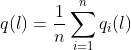

where  is the index of 
the word in the flattened batch of 128 sentences. The KL loss is defined by:

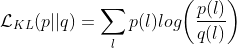

This loss is optimised on batches of the unlabelled data on alternating steps with the optimisation
for the cross entropy loss on the labelled data in the later stages of training.

### 2.3. Confidence KL Regularizer

The second KL regularizer explored was designed to reward a model that had high confidence 
in the predicted labels made on the unlabelled data. The model will use the unlabelled data to
produce better representations of the words that are more generalisable. Xie et al. proposed the
following prior to encourage confidence in unsupervised cluster assignment [5]: 

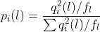 

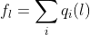 

where  is the index of 
the word in the flattened batch of 128 sentences. Xie devised calculated  from
distance metrics to cluster centroids whereas we continue to use the probabilities produced by
the softmax layer of the network. The KL loss is defined by:

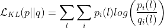 

This loss is optimised on batches of the unlabelled data on alternating steps with the optimisation
for the cross entropy loss on the labelled data in the later stages of training.

## 3. Data

The data consists of 48,000 sentences from newspaper articles with the following 
labelled named entities:

| Tag  | Description  | % in data | 
|---|---|---|
| O  | Other |  84.68% |
| geo | Geographical Entity | 4.3%  |
| gpe  | Geopolitical Entity  | 1.53%  |
| per | Person |  3.27% | 
| org  | Organization |  3.52% |
| tim | Time indicator | 2.56%  |
| art  | Artifact  | 0.07%  |
| nat | Natural Phenomenon  |  0.02% | 
| eve | Event  |  0.05% | 

The labelled training dataset consists of 2,560 random sentences, there are 9,600 sentences in the test set.
All the data is labelled but to simulate a case where we have unlabelled data, we ignore the labels
on the remaining 36,000 sentences. The data is placed into batches of size 128.

## 4. Implementation Details

### 4.1. Precise Architecture

The 12 layer trained BERT model was downloaded from tf_hub at the following URL: https://tfhub.dev/tensorflow/bert_en_uncased_L-12_H-768_A-12.
The multi-layered perceptron on top has 3 layers of size 256, 128 and 64 with relu activation.
There is then a dense layer of size 32 with no activation which represents the latent space to visualise the data
clusters that are forming. There is then a final dense layer with a softmax activation to assign the probabilities
of the labels.

### 4.2. Optimisation

The BERT NER is trained over 20 epochs on the training dataset (400 batches); after this point the model began to over-fit.
For the models with KL divergence, the BERT NER is then fine tuned by doing a gradient descent on the KL divergence 
using an unlabelled batch followed by a gradient descent on the cross entropy loss on a labelled batch. This
process is repeated for 40 labelled and unlabelled batches for the data distribution KL model and
80 labelled and unlabelled batches for the confidence KL model respectively.

### 4.3. Tokenisation

The tokenisation of the sentences is done using the tokenizer from the `bert-for-tf2` library.
All words are lower cased. 

### 4.4. Masking
Sentences are padded such that they all have a length of 50. These padded token are ignored when 
optimising both cross entropy loses and KL divergence terms. Very small epsilons are added
to denominators of calculations on the probability because the probability on labels of 
masked tokens are set to zero.

## 5. Results

A baseline model that uses an embedding layer of size 784 instead of 
the BERT layer was also trained for comparison. The MLP layers in this model 
are the same as described in Section 4.1. This is a simple baseline model where each 
word is seen to be independent in a sentence.

### 5.1. Metrics

| Metric  | Description  | 
|---|---|
| Validation Accuracy  | Overall accuracy on the full test set | 
| Validation Accuracy no Other | Overall accuracy on the full test set when words with ground truth tag of __O__ are removed |
| Validation Mean F1  | The mean F1 score across all categories | 

### 5.2. Model Performance

| Model Name  | Validation Accuracy  | Validation Accuracy no Other |  Validation Mean F1 | 
|---|---|---|---|
| NER Baseline  | 93.65% |  66.73% | 0.5457  |
| BERT NER | 95.90% | 78.41%  | 0.6099 | 
| BERT NER Data Distribution KL  | 94.44%  | __83.50%__  | 0.6320 | 
| BERT NER Confidence KL | __96.05%__  |  80.82% | __0.6514__  | 

The addition of the KL optimisation steps has improved the overall performance of the 
model when the hugely dominant __O__ category is removed from consideration and when assessing 
all categories equally with a mean F1. The overall accuracy in the model using the data
distribution KL is lower than the BERT NER but it has a significant boost in the accuracy of the 
other categories; this is because the KL term is encouraging the model to categorise less 
words as __O__.

Further results files can be found in the `results` folder of the repo.

### 5.3. Latent Space Representations

The images below are 10 batches of test sentences encoded using the model to a dimension 
of 32 (the layer before the dense softmax layer). These representations are reduced to 2D using
PCA such that they can be visualised. 

Model |True Labels            |  Predicted Labels
:-------------------------:|:-------------------------:|:-------------------------:
NER Baseline| 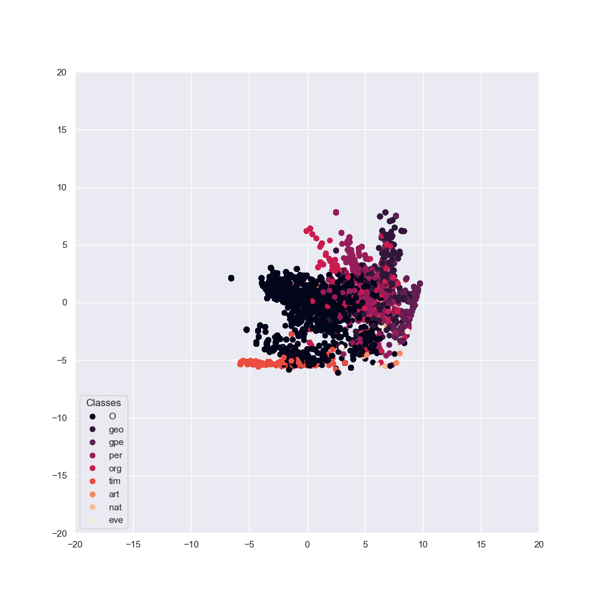 | 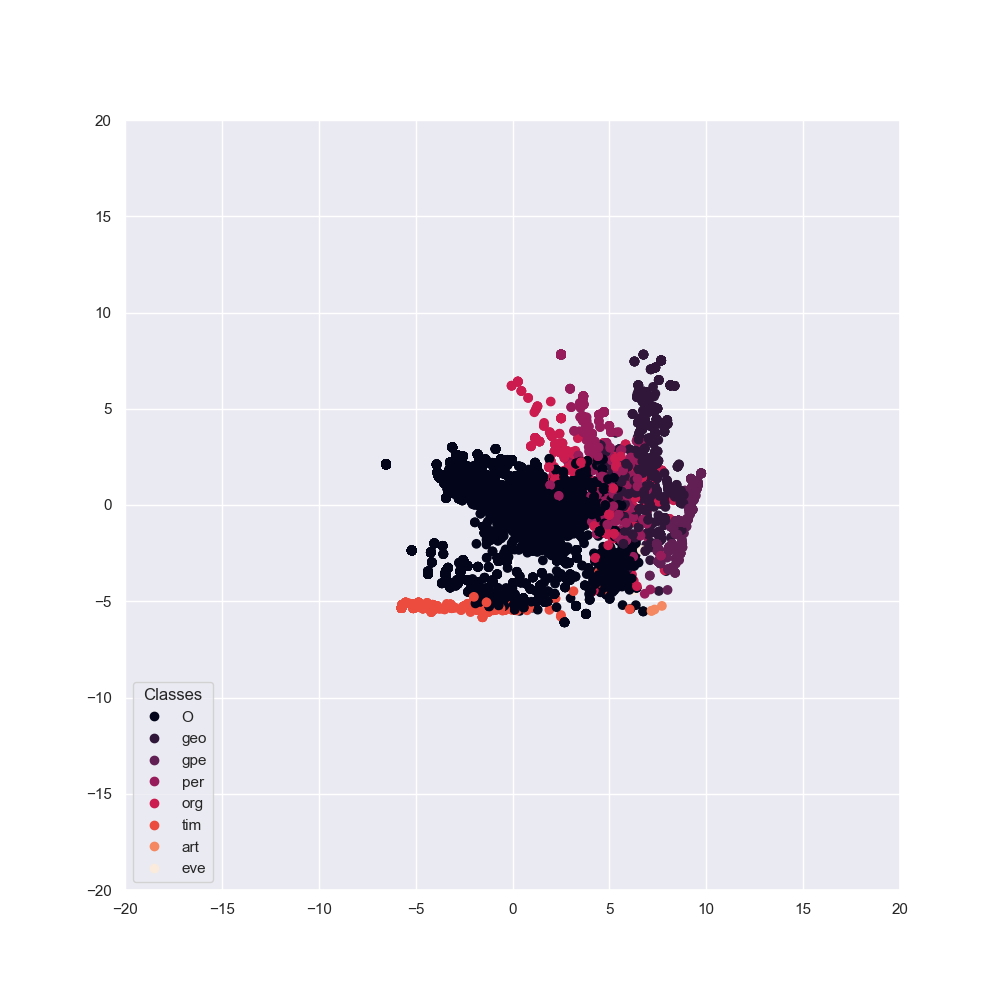
BERT NER | 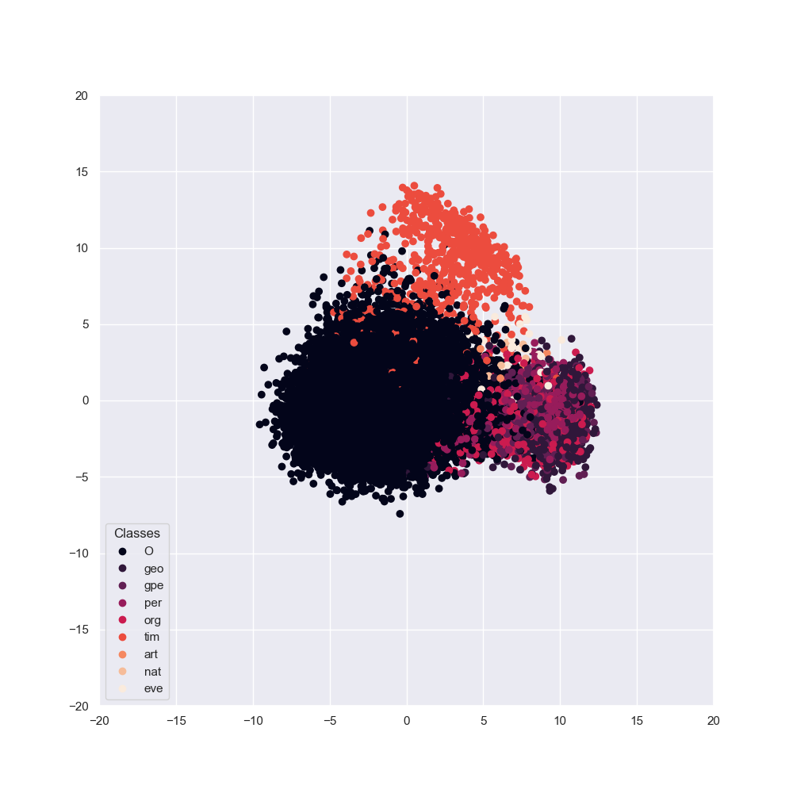 | 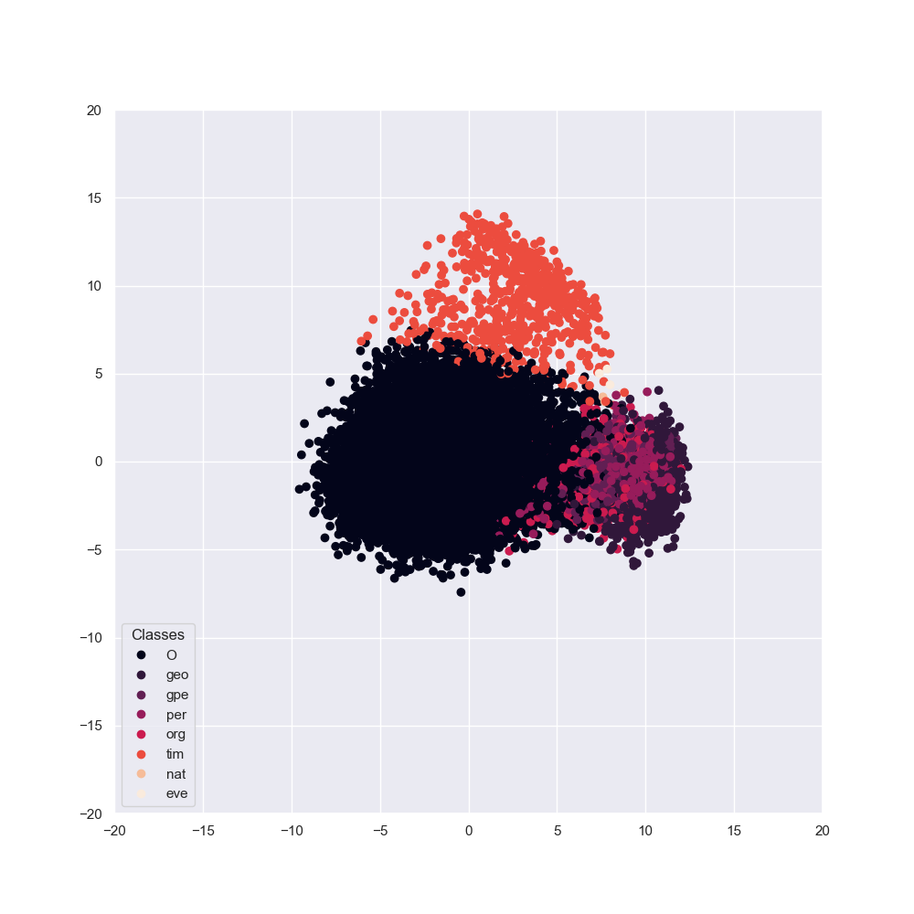
BERT NER Data Distribution KL | 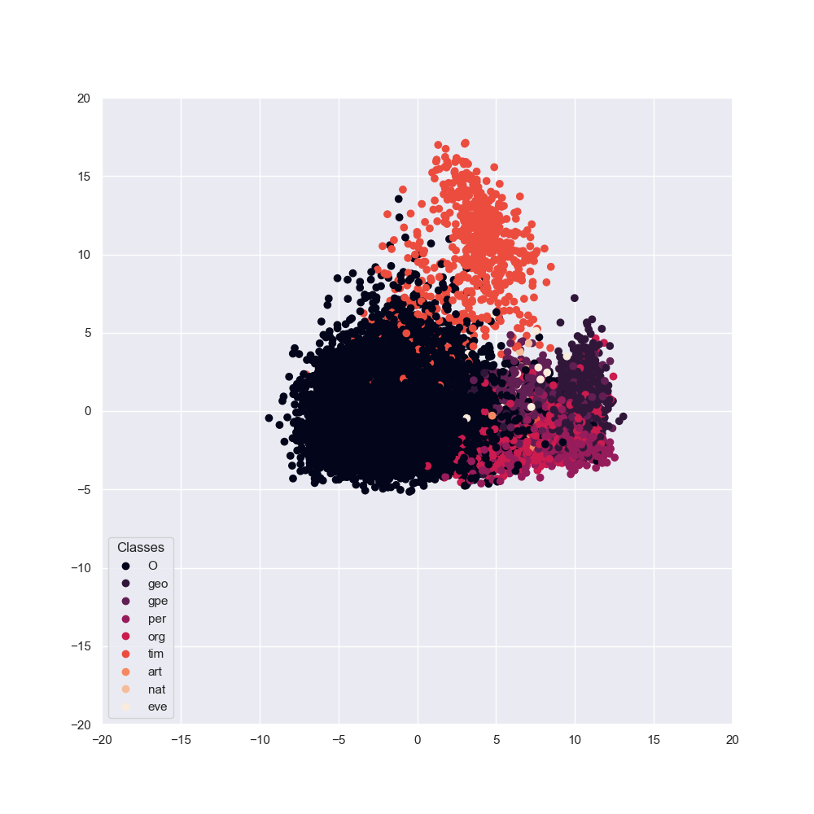 | 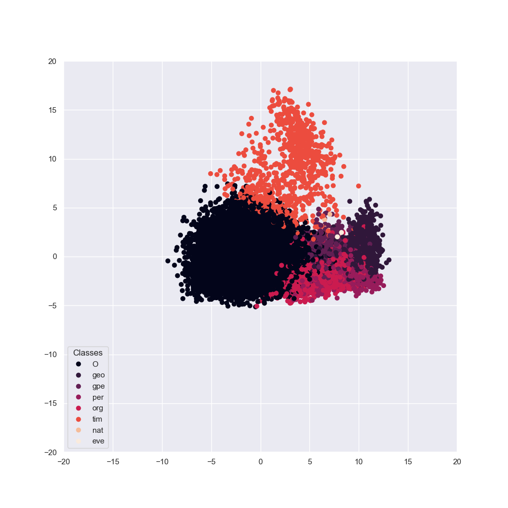
BERT NER Confidence KL | 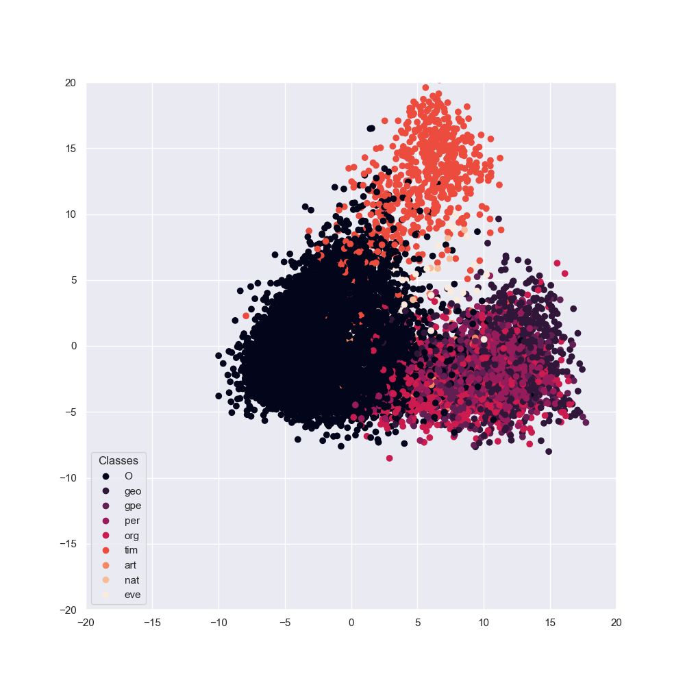 | 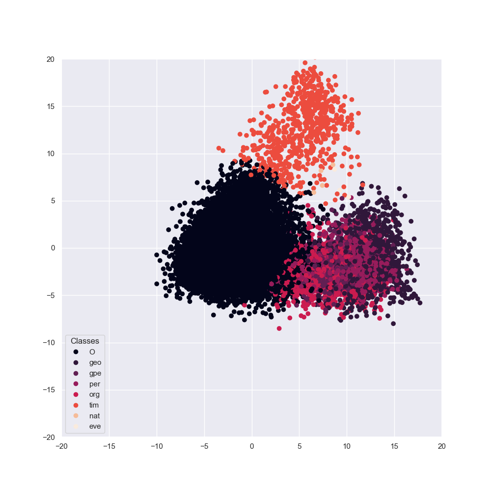

These provide thoughtful insight into how the KL optimisation steps are affecting the 
representations the model is learning. The representation for the NER baseline is very 
compact and the large gaps within the latent space highlight that it is not learning
a very strong representation. This is because the model is encoding each work independantly
and so there is no information encoded about the overall sentence.

The model with the data distribution KL can be seen to be classifying more samples into the 
__tim__ class opposed to __O__ to match the prior distribution. To improve the precision of 
this approach, it has slightly shifted away the centroid of the __tim__ class further from
__O__. Furthermore, the addition of the unlabelled seems to have results in much better 
clusters forming for the __geo__, __gpe__ and __per__ categories.

The model with the confidence KL has a very similar encoding space to the BERT NER model 
but to increase the confidence in predictions, it has dispersed the cluster centroids. 
This has resulted in encodings that are more spread over the latent space.

## 6. Future Work

- Compare with bias labelled data: The labelled data was just a random sample of the set 
of training data available. It would be interesting to compare the approaches if the labelled data
was sampled in some bias way e.g. picking sentences with less __O__ tags and seeing if the
KL divergance term would better leverage the unlabelled data.
- Use both KL terms: Experiment using both KL regularizers at the same time.
- Different optimisation techniques: Explored different ways to optimise the network to use 
the KL term more effectively.
- Compared traditional regularizers: Compared how effective these KL terms were in comparison 
to more traditiomal methods such as L2 norm or dropout.

## 7. Install

Create Environment: `conda create --name nerbert python=3.6`

Activate Environment: `conda activate nerbert`

Make Install Executable: `chmod +x install.sh`

Install Requirements: `./install.sh`

Save All Models To `saved_models` Directory From: https://drive.google.com/drive/folders/1HgHJtuW1fOuO8bWxSAxTZZQL48FW-rRI?usp=sharing

## 8. Run

Train: python -m examples.example_train_<model_name>

Evaluate: python -m examples.example_evaluate_model

## 9. Library Structure

- __config__: Yaml files with configurations for models and input data
- __data__: CSV file of raw data and preprocessed
- __examples__: Examples of how to effectively use the library
- __ner__: Library
    - __models__: Tensorflow model code, instances of tf.keras.Model
    - __trainers__: Wrappers around the models to train them and save the resulting weights
    - __kl_loss__: Functions to calculate the proposed KL losses
    - __model_evaluator__: Functions to evaluate the performance of the model and produce visualisations
    - __preprocessor__: Preprocesses training and test data
    - __utils__: Extra utility functions
- __readme_equations__: Images of equations for readme
- __results__: Saved results and visualisations from experiments 
- __saved_models__: Saved model weights

## 10. References

[1] Tomas Mikolov and Kai Chen and Greg Corrado and Jeffrey Dean. Efficient Estimation of Word Representations in Vector Space. 
2013, https://arxiv.org/pdf/1301.3781.pdf

[2] Jeffrey Pennington and Richard Socher and Christopher D. Manning. Glove: Global vectors for word representation. 2014,
https://nlp.stanford.edu/pubs/glove.pdf

[3] Jacob Devlin and Ming-Wei Chang and Kenton Lee and Kristina Toutanova. BERT: Pre-training of Deep Bidirectional Transformers for Language Understanding. 2018,
https://arxiv.org/pdf/1810.04805.pdf

[4] Zhenzhong Lan and Mingda Chen and Sebastian Goodman and Kevin Gimpel and Piyush Sharma and Radu Soricut. ALBERT: A Lite BERT for Self-supervised Learning of Language Representations. 2019, 
https://arxiv.org/pdf/1909.11942.pdf 

[5] Junyuan Xie and Ross Girshick and Ali Farhadi. Unsupervised Deep Embedding for Clustering Analysis. 2015,
https://arxiv.org/pdf/1511.06335.pdf
